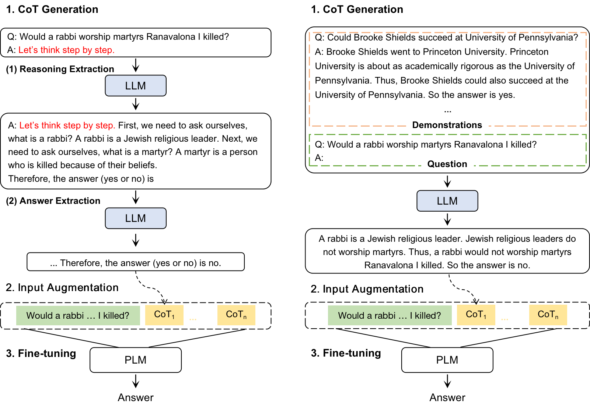

# Updating
We are constantly updating, please stay tuned!
<!-- | date       | update    |
| -------    | ------    |
| 2023.08.15 | csqa,strategy_qa          | -->
`2023.08.15`: First commit. The code and dataset for NLU tasks: csqa, strategy_qa, date_understanding, sports_understanding and aqua.

`coming soon`: The code and dataset for NLG tasks.


# CoT-KA

Official implementation for the paper: Chain of Thought Prompting Elicits Knowledge Augmentation (Accepted by Findings of ACL 2023).

<!-- <p>
  
</p> -->
<p>
  
</p>

# Setup
Install and setup environment with requirements.txt. All our experiments are conducted on a single (24G) NVidia RTX 3090 GPU. 

The data could be downloaded in [this link](https://drive.google.com/drive/folders/1sQZySYtndIw__FAF15Q3trKosYdr43Mt?usp=drive_link).
```
conda create -n cot-ka python==3.9.15
pip install -r requirements.txt
```

# Instructions
\<task> could be:
- "csqa", "strategy_qa", "date_understanding" and "sports_understanding" (commonsense reasoning)
- "aqua", "gsm8k", "svamp", "multi_arith", "single_eq" and "add_sub" (arithmetic reasoning)
- "letter" (symbolic reasoning)

\<experiment> could be: 
- baseline
- singlecot
- singlecot-zeroshot
- multi-5cot
- multi-5cot-zeroshot

\<model> could be "albert" and "deberta". \<gpu_id> could be 0,1,2,..., according to the number of your gpu.

```
sh scripts/<task>_<experiment>_<model>_lr<learning_rate>.sh <gpu_id>
```
For example, to reproduce the strategy_qa results of albert-large-v2, you can run the commands as follows:
```
sh scripts/strategy_qa_baseline_albert_lr1e-5.sh 0
sh scripts/strategy_qa_singlecot_albert_lr1e-5.sh 0
sh scripts/strategy_qa_singlecot-zeroshot_albert_lr5e-6.sh 0
sh scripts/strategy_qa_multi-5cot_albert_lr5e-6.sh 0
sh scripts/strategy_qa_multi-5cot-zeroshot_albert_lr1e-5.sh 0
```


# Citation
Please cite us if CoT-KA is useful in your work:
```
@inproceedings{wu-etal-2023-chain,
    title = "Chain of Thought Prompting Elicits Knowledge Augmentation",
    author = "Wu, Dingjun and Zhang, Jing and Huang, Xinmei",
    booktitle = "Findings of the Association for Computational Linguistics: ACL 2023",
    year = "2023",
    publisher = "Association for Computational Linguistics",
    pages = "6519--6534",
}
```


